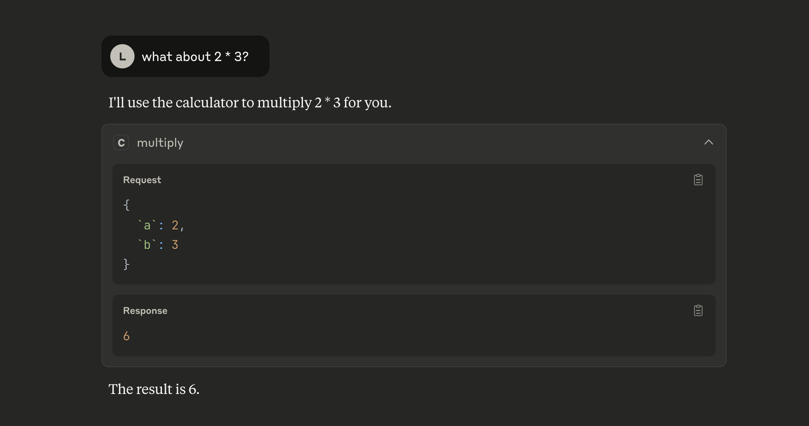
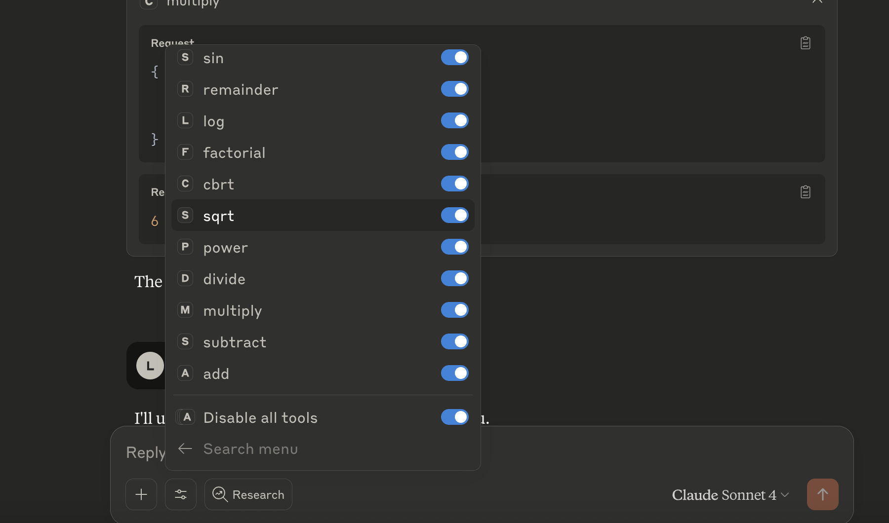

# Custom MCP Calculator Server

Learning how to build MCP servers and integrate them with claude desktop

## Features
- 12+ mathematical functions (add, factorial, trigonometry, etc.)
- Real-time integration with Claude Desktop
- Built with Python MCP SDK

## Demo

